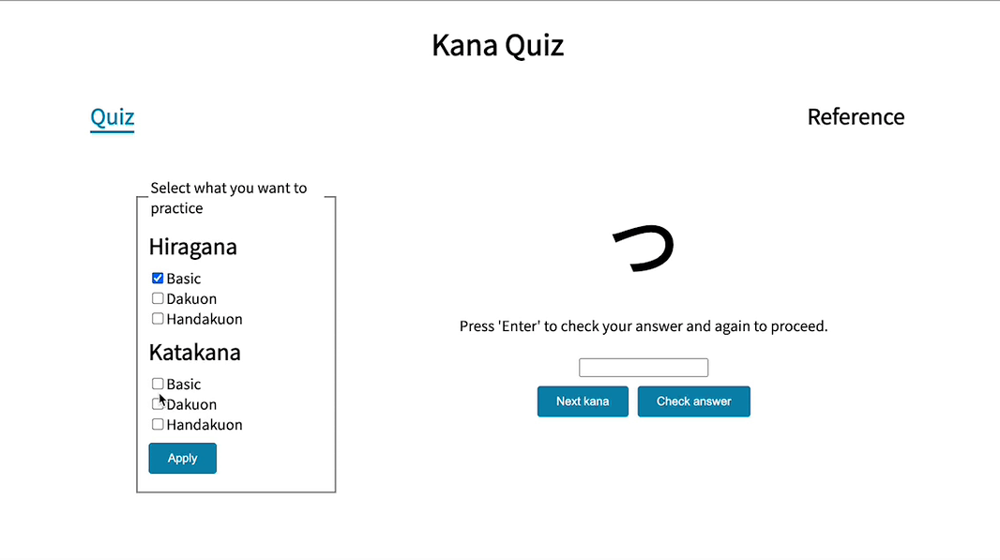

# Kana Quiz
Kana Quiz is a study tool used to learn all the Hiragana and Katakana characters in the Japanese language. I made this because I wanted an easy way to quiz myself in order to learn. I got inspiration to make it based on a similar web app that already exists, but I did not like very much.

## [Live Demo](https://perezc52.github.io/kana-quiz/)

## How It's Made:

**Tech used:** HTML, CSS, JavaScript, React

A nav bar renders either the quiz and options component to test yourself or the reference component to learn the characters. The options component lets the user select which characters they want to practice and then the data is filtered from a data file and passed to the quiz component. The quiz component shuffles the array that is given and shows them to the user one at a time until it runs out.

## Optimizations

In the future, I would like to style it more and I would like to expand on the reference component to be more than an image and have the user be able to click on characters to hear its pronounciation.

## Lessons Learned:

This project helped me improve my front-end skills more and I learned more about oraganizing code when it starts to get big. With react specifically, I learned more about how and when components are re-rendered and the intricacies of using useEffect. And I got better and overcoming errors and understanding them.
